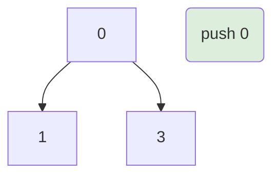
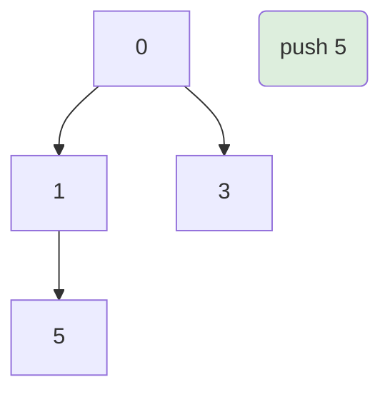
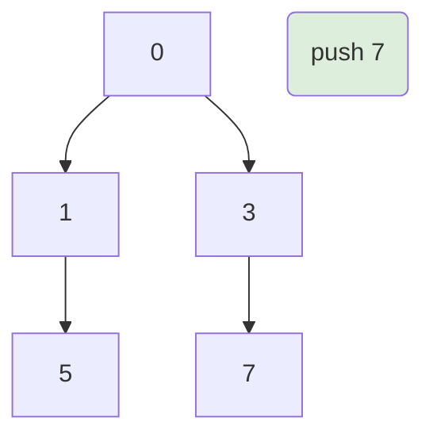
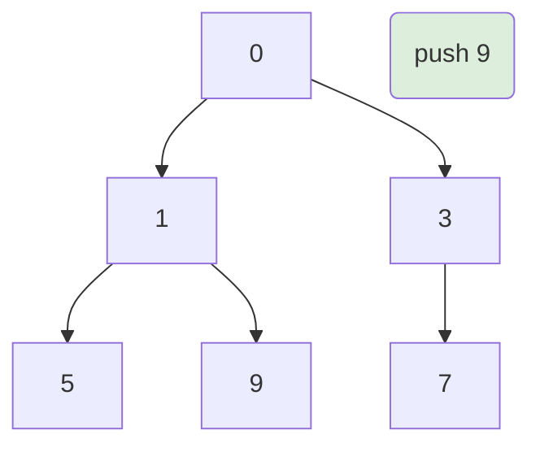
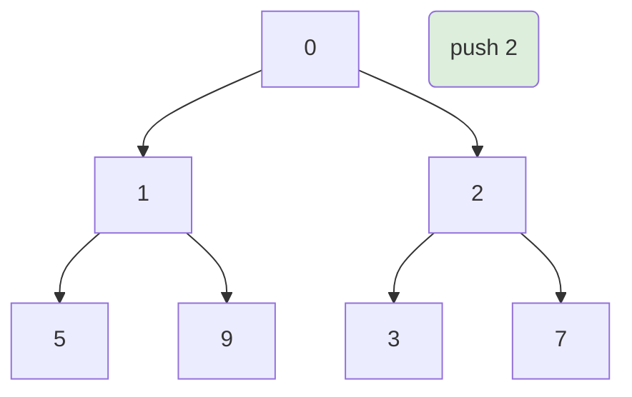
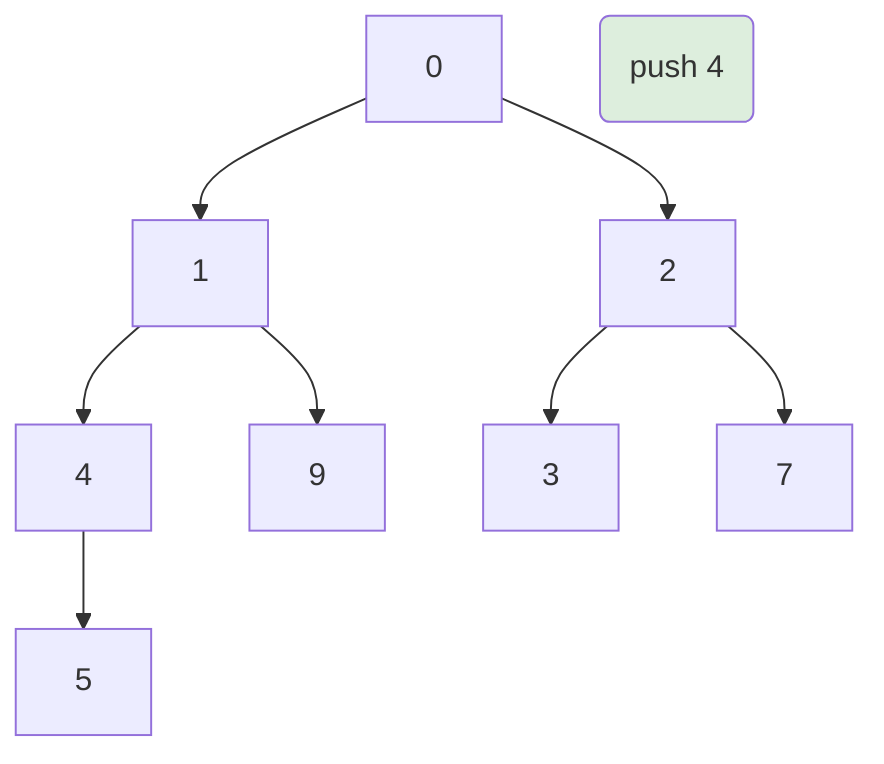
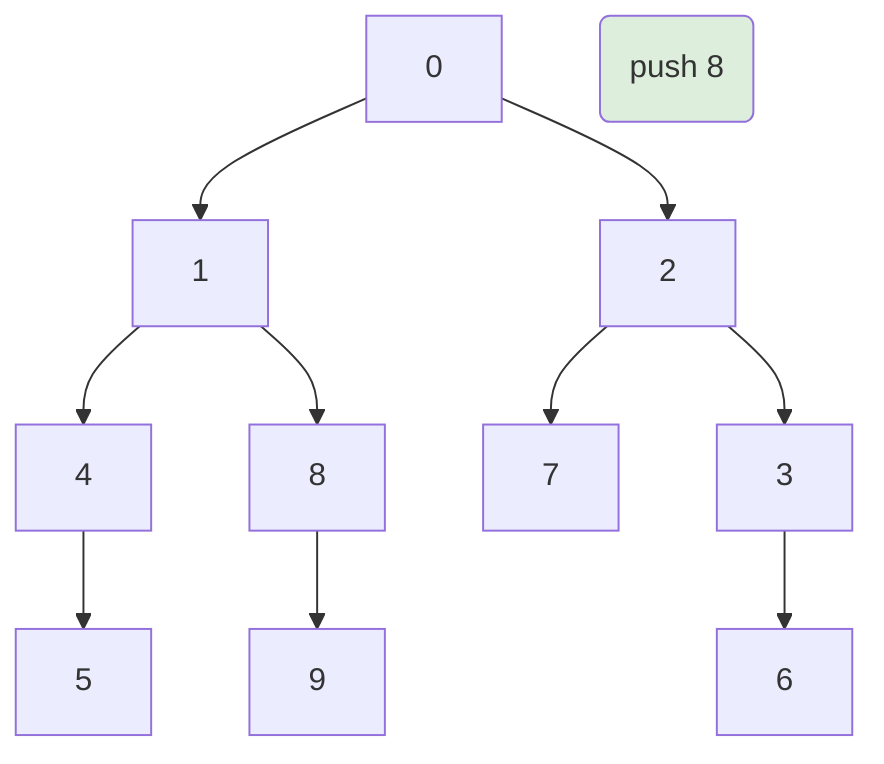
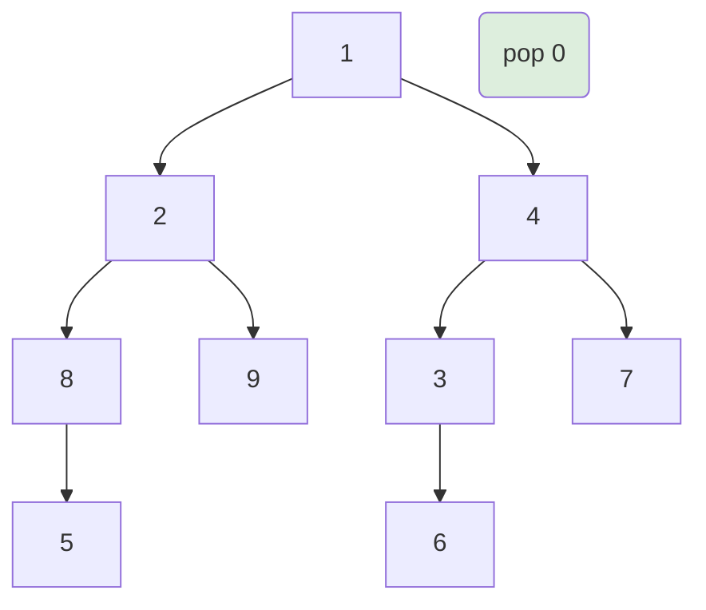

bhenchod```mermaid
graph TD
A("push 1")
style A fill:#ded
1 --> 3
```
---

```mermaid
graph TD
A("push 0")
style A fill:#ded
0 --> 1
0 --> 3
```
---

```mermaid
graph TD
A("push 5")
style A fill:#ded
0 --> 1
0 --> 3
1 --> 5
```
---

```mermaid
graph TD
A("push 7")
style A fill:#ded
0 --> 1
0 --> 3
1 --> 5
3 --> 7
```
---

```mermaid
graph TD
A("push 9")
style A fill:#ded
0 --> 1
0 --> 3
1 --> 5
1 --> 9
3 --> 7
```
---

```mermaid
graph TD
A("push 2")
style A fill:#ded
0 --> 1
0 --> 2
1 --> 5
1 --> 9
2 --> 3
2 --> 7
```
---

```mermaid
graph TD
A("push 4")
style A fill:#ded
0 --> 1
0 --> 2
1 --> 4
1 --> 9
4 --> 5
2 --> 3
2 --> 7
```
---

```mermaid
graph TD
A("push 6")
style A fill:#ded
0 --> 1
0 --> 2
1 --> 4
1 --> 9
4 --> 5
2 --> 3
2 --> 7
3 --> 6
```
---

```mermaid
graph TD
A("push 8")
style A fill:#ded
0 --> 1
0 --> 2
1 --> 4
1 --> 8
4 --> 5
8 --> 9
2 --> 3
2 --> 7
3 --> 6
```
---

```mermaid
graph TD
A("pop 0")
style A fill:#ded
1 --> 2
1 --> 4
2 --> 8
2 --> 9
8 --> 5
4 --> 3
4 --> 7
3 --> 6
```
---
Error: Heap invalid at node 8
