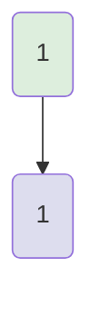
---
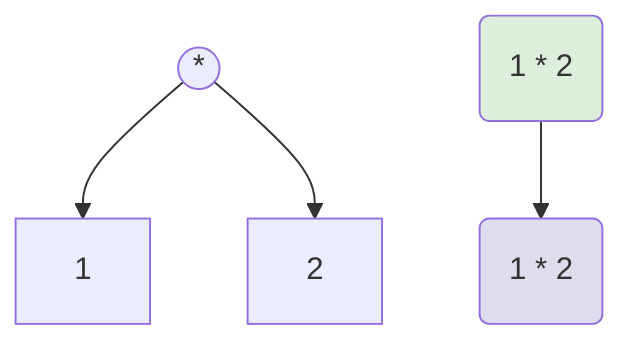
---
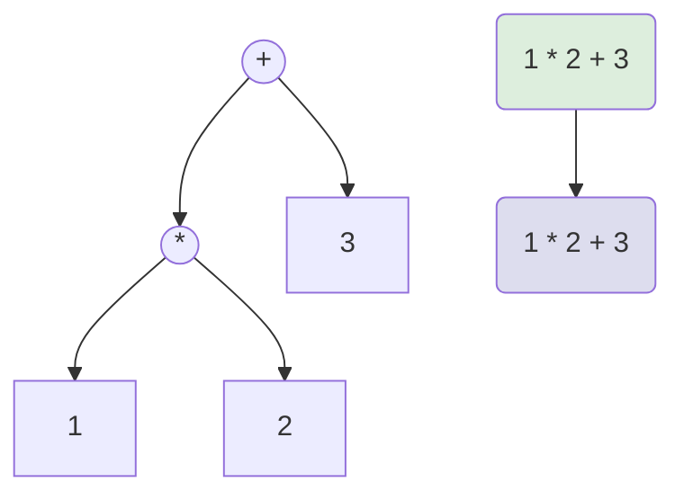
---
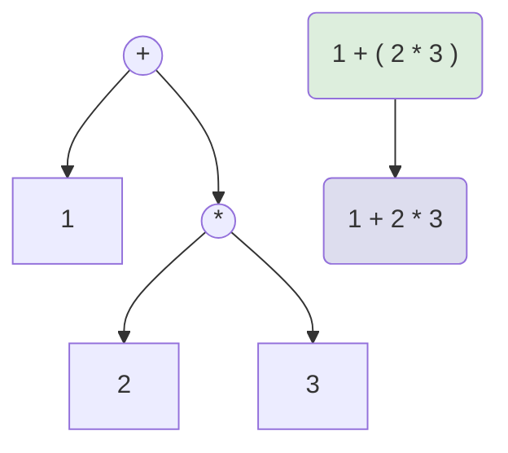
---
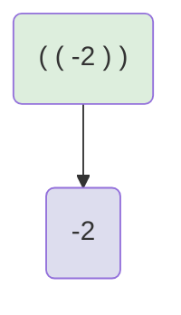
---
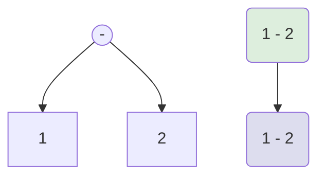
---
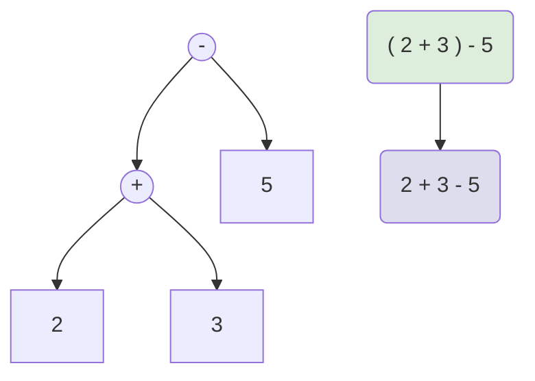
---
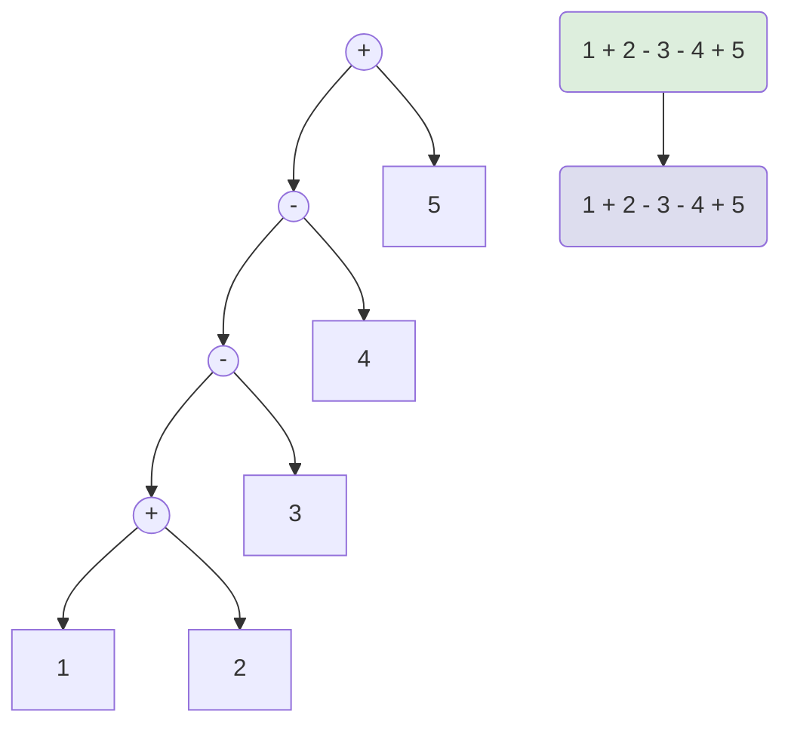
---
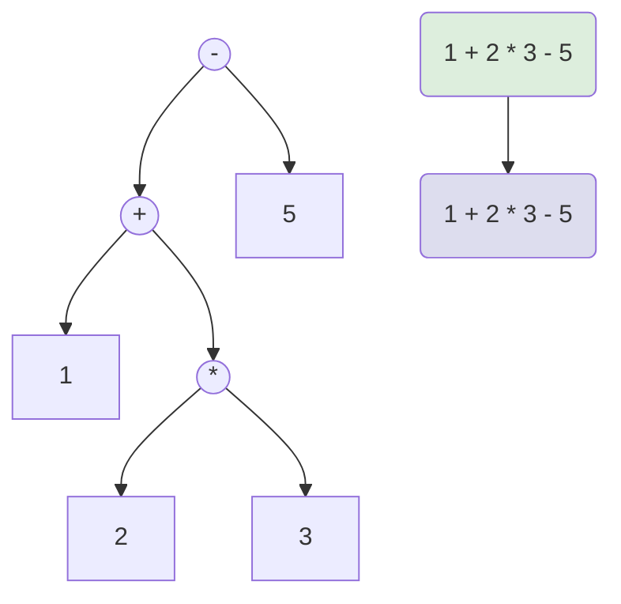
---

---
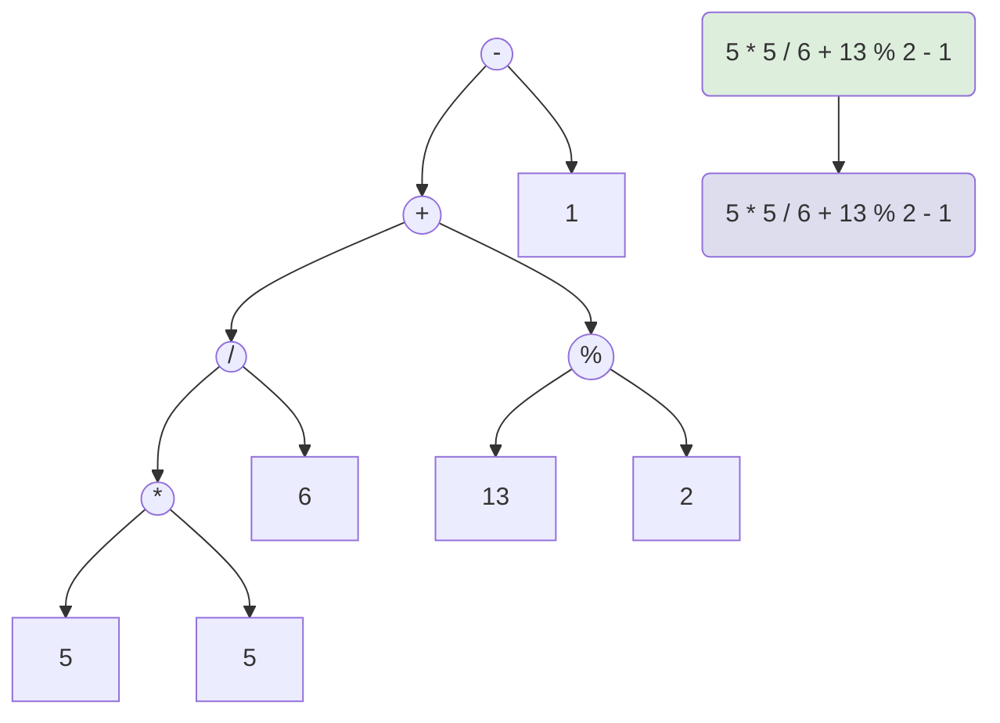
---
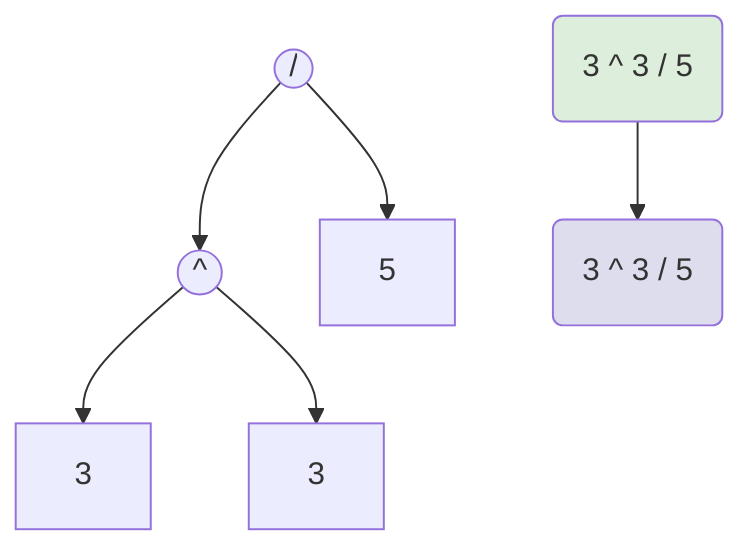
---
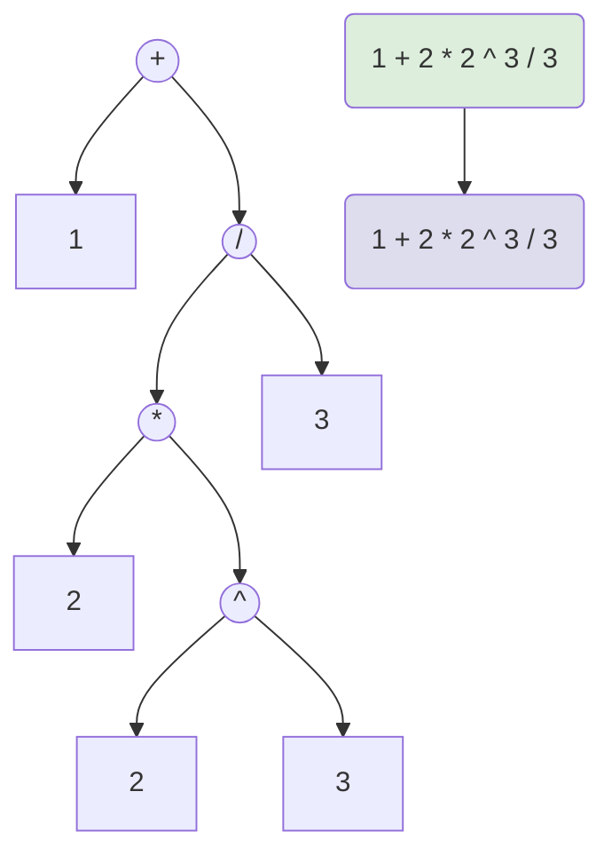
---
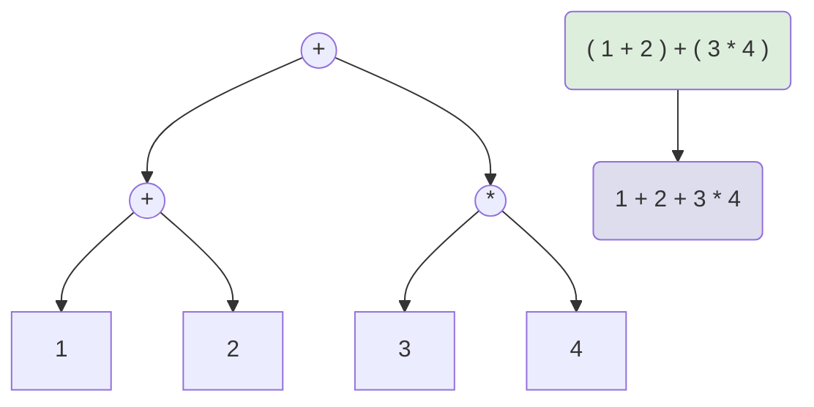
---
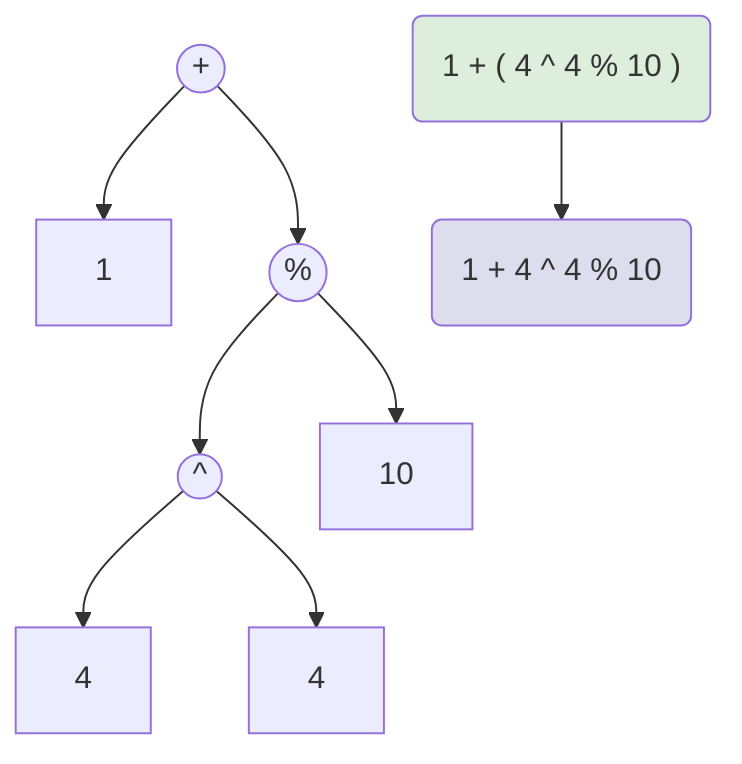
---
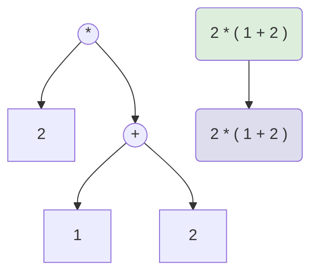
---
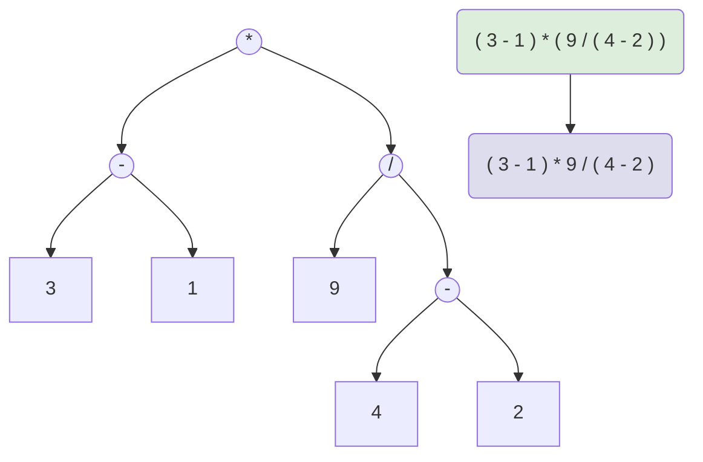
---
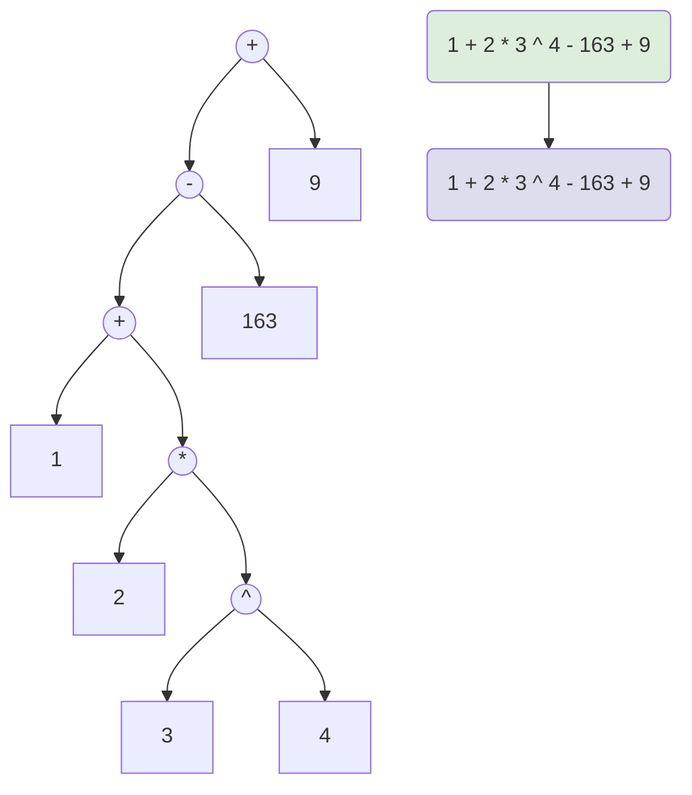
---
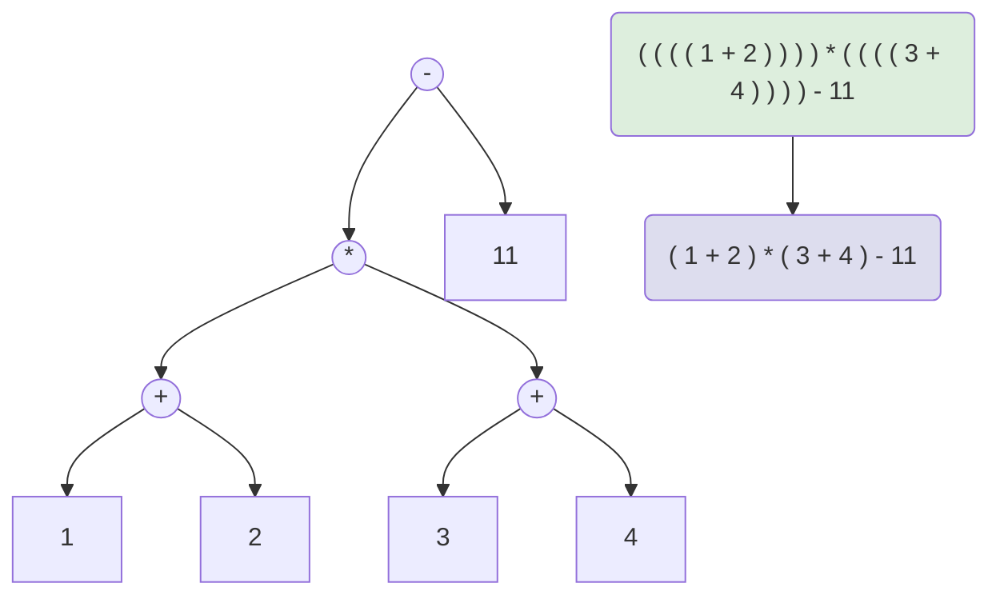
---
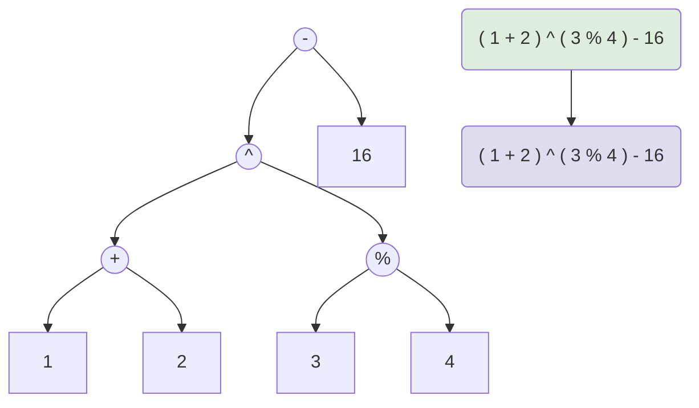
---
```mermaid
graph TD
A("( ( ( 1 + 2 ) ) ) ^ ( ( ( 3 + ( 4 - 5 ) ) ) )")
B("( 1 + 2 ) ^ ( 3 + 4 - 5 )")
A --> B
style A fill:#ded
style B fill:#dde
9(("^")) --> 3(("+"))
9(("^")) --> 8(("+"))
3(("+")) --> 1[1]
3(("+")) --> 2[2]
8(("+")) --> 4[3]
8(("+")) --> 7(("-"))
7(("-")) --> 5[4]
7(("-")) --> 6[5]
```
---
```mermaid
graph TD
A("( 1 + 2 ) * ( 3 + 4 )")
B("( 1 + 2 ) * ( 3 + 4 )")
A --> B
style A fill:#ded
style B fill:#dde
7(("*")) --> 3(("+"))
7(("*")) --> 6(("+"))
3(("+")) --> 1[1]
3(("+")) --> 2[2]
6(("+")) --> 4[3]
6(("+")) --> 5[4]
```
---
```mermaid
graph TD
A("-1 ^ 2 * 3 + 4 + 5 * 6 ^ 2")
B("-1 ^ 2 * 3 + 4 + 5 * 6 ^ 2")
A --> B
style A fill:#ded
style B fill:#dde
13(("+")) --> 7(("+"))
13(("+")) --> 12(("*"))
7(("+")) --> 5(("*"))
7(("+")) --> 6[4]
5(("*")) --> 3(("^"))
5(("*")) --> 4[3]
3(("^")) --> 1[-1]
3(("^")) --> 2[2]
12(("*")) --> 8[5]
12(("*")) --> 11(("^"))
11(("^")) --> 9[6]
11(("^")) --> 10[2]
```
---
